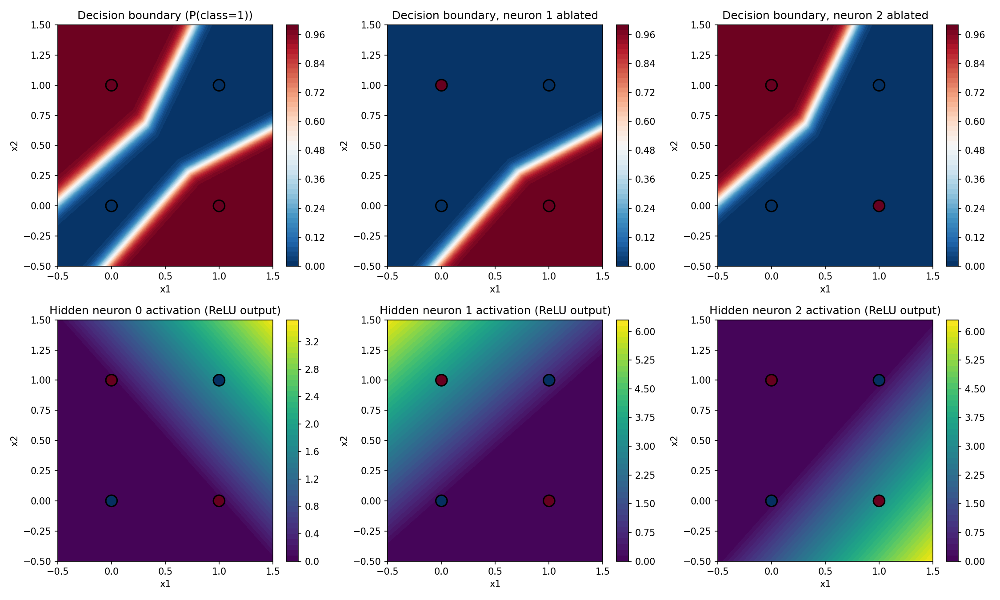

# mech_interp_basic_to_adv

A learning project working through mechanistic interpretability from first principles —
starting with hand-built neural nets and basic ablation studies, building up to more
advanced techniques over time. Each module lives in its own folder with its own README.

## Modules

### [module_0.1_nn_from_scratch](module_0.1_nn_from_scratch/readme.md)

A neural network built from scratch in numpy (forward + hand-derived backprop, verified
against PyTorch autograd), trained on XOR, then interpreted with a simple ablation study:
zero out each hidden neuron one at a time and see what breaks.

**Result:** the trained network split the XOR task cleanly across its 3 hidden neurons —
neuron 1 detects one "should be 1" input, neuron 2 detects the other, and neuron 0 turned
out to be redundant capacity the network didn't need. Ablating a neuron only broke the
exact input it was responsible for.

See the module's [readme](module_0.1_nn_from_scratch/readme.md) for how it's built and
[conclusion.md](module_0.1_nn_from_scratch/conclusion.md) for the full ablation writeup.
